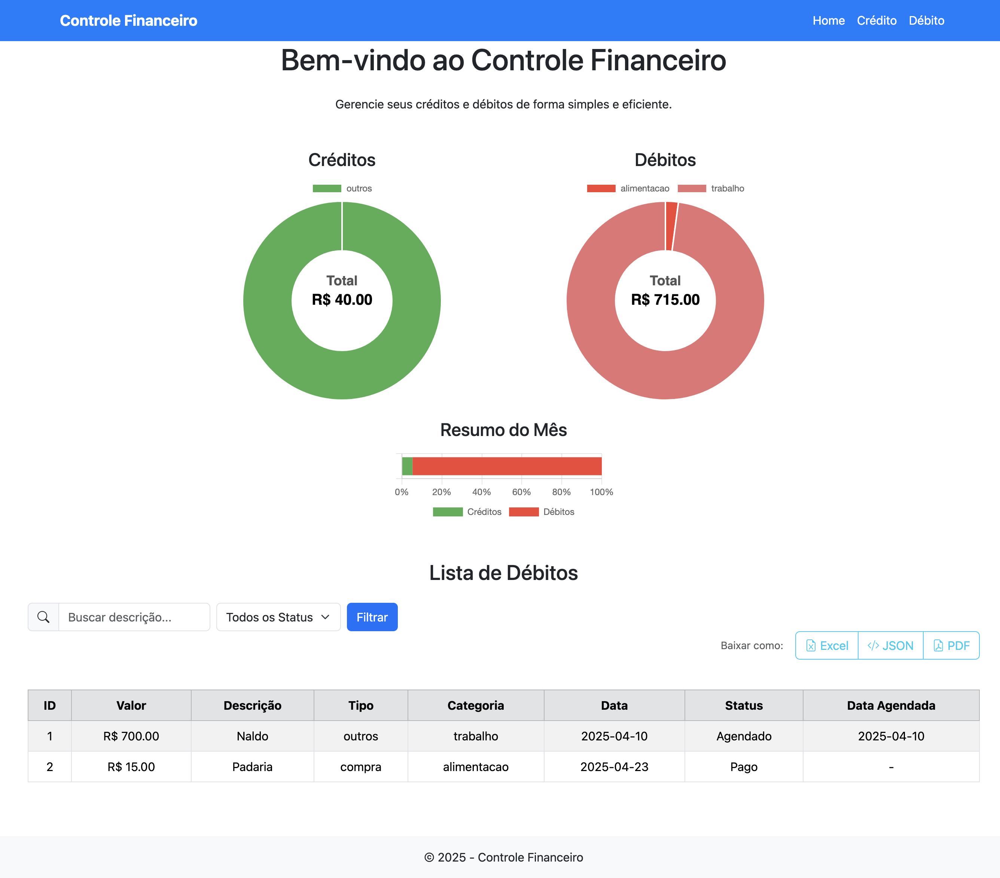
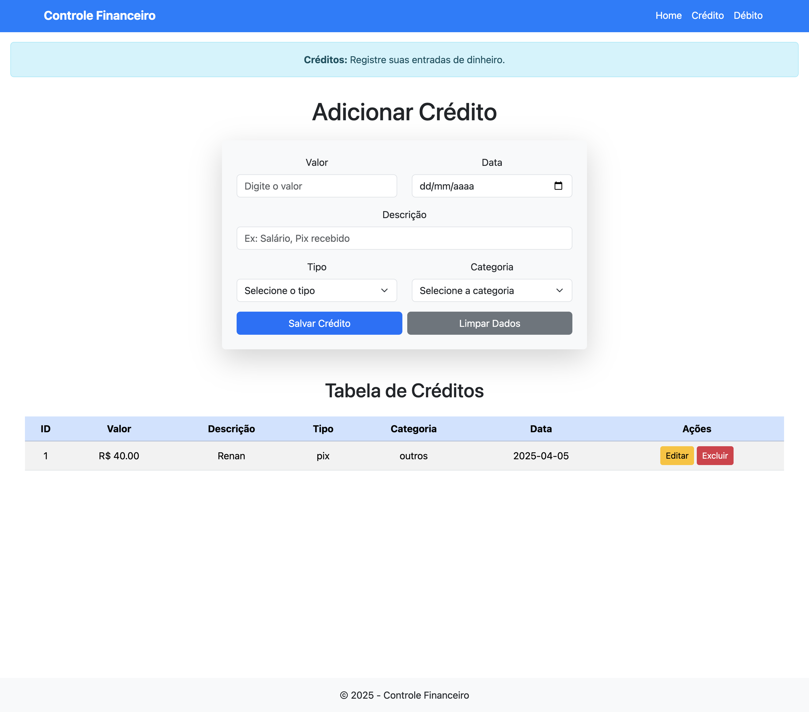
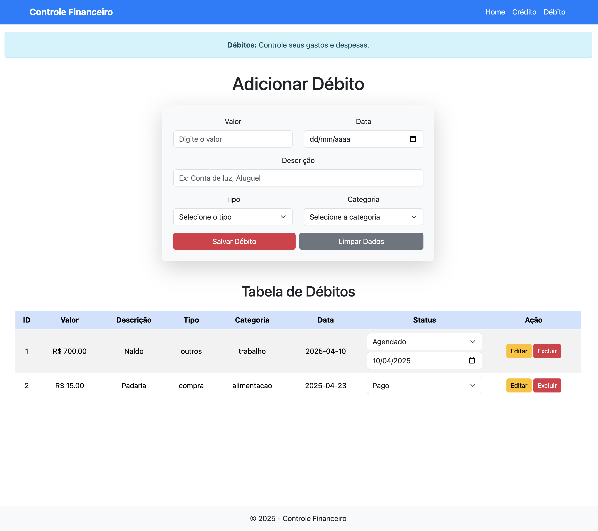

# 💸 Sistema de Controle Financeiro

Aplicação web para controle de créditos e débitos, com funcionalidades de filtro, busca e exportação de dados em diferentes formatos.

## 📌 Funcionalidades

- ✅ Cadastro e visualização de **créditos** e **débitos**
- 🔎 Filtro por **descrição** e **status**
- 📊 Visualização em **tabela responsiva**
- 🗂️ Exportação de dados para:
  - `.xlsx` (Excel)
  - `.json`
  - `.pdf`
- 📅 Suporte a **status agendado** com data futura
- 🔄 Botão de limpar filtros para reset rápido

## 🛠️ Tecnologias Utilizadas

- **Python** (Flask)
- **SQLite** como banco de dados
- **Pandas** para manipulação de dados
- **XlsxWriter** para geração de planilhas Excel
- **FPDF** para criação de relatórios em PDF
- **Bootstrap 5** para layout e responsividade
- **HTML + Jinja2** (templates Flask)

## 📥 Instalação

1. Clone o repositório:
   ```bash
   git clone https://github.com/seuusuario/nome-do-projeto.git
   cd nome-do-projeto
2. Crie e ative um ambiente virtual:
    ```bash
   python -m venv venv
   source venv/bin/activate  # Ativação em MacOS
   venv\Scripts\activate  # Ativação em Windows
3. Instalar as dependências:
    ```bash
   pip install -r requirements.txt
4. Execute o projeto:
   ```bash
   flask run
   
## 📦 Dependências principais
- **Flask**
- **pandas**
- **xlsxwriter**
- **fpdf**

## 🧪 Estrutura do Projeto
```
├── app.py               # Arquivo principal do Flask
├── financeiro.db        # Banco de dados SQLite
├── templates/
│   └── home.html        # Página principal com tabela, filtros e botões
├── static/
│   └── css/             # (opcional) Estilos adicionais
├── exportar_dados/      # Lógica de exportação (caso modularize)
└── README.md
```

## 📂 Exportação de Dados
Na parte superior da tabela, você pode exportar os dados em três formatos:
- Excel (.xlsx) – organizado por abas: Créditos e Débitos
- JSON – estrutura de fácil leitura para sistemas
- PDF – relatório simples com todos os registros

## ✨ Captura de tela
<p align="center">
  
  
  
</p>

## 👨‍💻 Autor
Diogo – Técnico e Desenvolvedor em transição de carreira. \
Projetado com foco em produtividade, organização e controle financeiro pessoal/familiar.

## 📃 Licença
Este projeto é de uso pessoal, mas você pode adaptar conforme sua necessidade. Para fins comerciais, adapte com sua própria licença.

